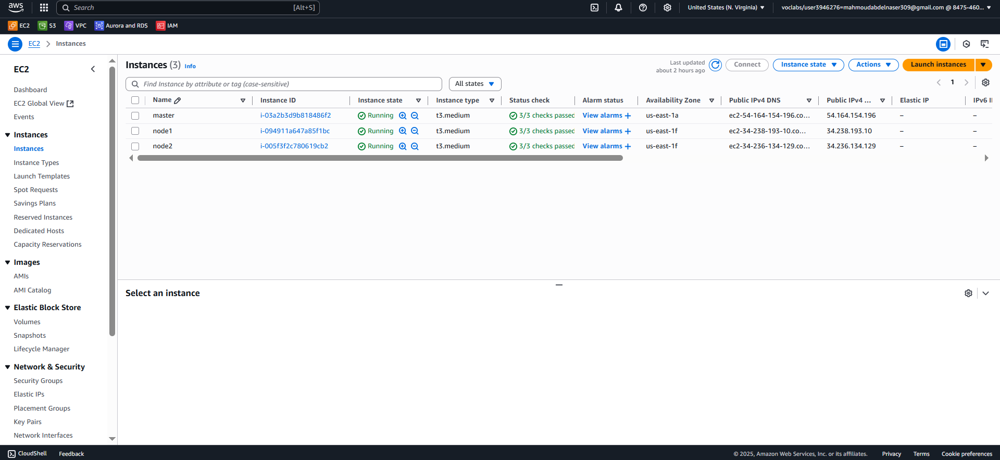
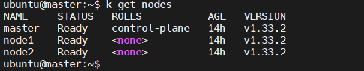

# Installing-kubeadm-v1.33 
    

# Setup Kubernetes Cluster on AWS using kubeadm v1.33

This project sets up a Kubernetes cluster manually using `kubeadm` on AWS EC2 instances. The setup consists of:

- 👑   1 Master Node
- 🧑‍💻 2 Worker Nodes

All nodes run Ubuntu 22.04 and are configured using a custom automation script.

---

## 🧰 Requirements

Before getting started, ensure the following:

- AWS account with permission to launch EC2 instances
- EC2 configuration:
  - **AMI**: Ubuntu Server 22.04LTS (64-bit)
  - **Instance Type**: t3.medium
  - **Storage**: 20 GB (EBS Volume)
  - **Security Group**:
    - Allow SSH (port 22)
    - Allow Kubernetes ports: # https://kubernetes.io/docs/reference/networking/ports-and-protocols/
      - 6443 (API server)
      - 2379–2380 (etcd)
      - 10250–10252 (Kubelet / controller)
      - 30000–32767 (NodePort range)
---

## 🧱 Architecture

```bash
+---------------------+        +---------------------+        +---------------------+
|     Master Node     | <----> |     Worker Node 1   | <----> |     Worker Node 2   |
|  kube-apiserver     |        |  kubelet, kube-proxy|        |  kubelet, kube-proxy|
|  controller-manager |        |                     |        |                     |
|  scheduler          |        |                     |        |                     |
+---------------------+        +---------------------+        +---------------------+
```
# ⚙️ Setup Steps
## 1. Launch EC2 Instances
Launch 3 EC2 instances with the above specs.
Name them master, node1, and node2.



## 2. SSH the three ec2 with MobaXterm using dns for each ec2

## 3. Run the Installation Script on All Nodes
```bash
chmod +x master-script.sh   # on master 
sudo ./master-script.sh     # on master
```
same also with other nodes ( node1, node2)
### after that reboot all instances

## 4. Initialize Kubernetes on the Master Node
Run the following command as sudo on the master node:
```bash
sudo kubeadm init --pod-network-cidr=10.244.0.0/16
```
start using your cluster, you need to run the following as a regular user:
```bash
mkdir -p $HOME/.kube
sudo cp -i /etc/kubernetes/admin.conf $HOME/.kube/config
sudo chown $(id -u):$(id -g) $HOME/.kube/config
```
### 🌐 Deploy a Pod Network CNI (Flannel)  through the master node:
```bash
kubectl apply -f https://raw.githubusercontent.com/coreos/flannel/master/Documentation/kubeflannel.yml
```
### To Create a new token as root
```bash
sudo kubeadm token create --print-join-command  
```


##  2. Joining Worker Nodes to the Kubernetes Cluster
You will use your kubeadm join command that was shown in your terminal when we initialized the master node.
paste in each worker node
#### The command would be similar of this:
```
sudo kubeadm join 172.31.6.233:6443 --token 9lspjd.t93etsdpwm9gyfib --
discovery-token-ca-cert-hash
sha256:37e35d7ea83599356de1fc5c80c282285cc3c749443a1dafd8e73f40
```
## ✅ Verification
Check node status
```
kubectl get nodes
```

## 💡 to enable auto-completion for kubernetes commands
```bash
sudo echo "source <(kubectl completion bash)" >> ~/.bashrc
sudo echo "alias k=kubectl" >> ~/.bashrc
sudo echo "complete -F __start_kubectl k" >> ~/.bashrc
source ~/.bashrc
```

# 📂 Author 
# Mahmoud Abdelnaser Elsayed
# DevOps Engineer 🚀
www.linkedin.com/in/mahmoud-998877b


